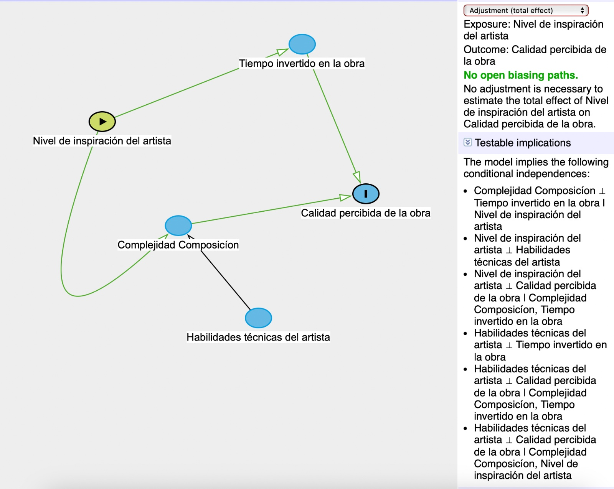

<center>

<h1>Tarea 5: MCMC</h1>

</center>

<center><strong>CC6104: Statistical Thinking</strong></center>

#### **Integrantes :**

-   Andrés Calderón Guardia
-   Delaney Tello Espinoza

#### **Cuerpo Docente:**

-   Profesor: Felipe Bravo M.
-   Auxiliar: Martín Paredes, Benjamín Farías
-   Ayudantes: Scarleth Betancurt, Emilio Díaz, Kevin Iturra, Renzo Zanca

### **Índice:**

1.  [Objetivo](#id1)
2.  [Instrucciones](#id2)
3.  [Referencias](#id3)
4.  [Primera Parte: Preguntas Teóricas](#id4)
5.  [Segunda Parte: Elaboración de Código](#id5)

### **Objetivo**<a name="id1"></a>

[Bienvenid\@s](mailto:Bienvenid@s){.email} a la primera tarea del curso Statistical Thinking. Esta tarea tiene como objetivo evaluar los contenidos teóricos de la primera parte del curso, los cuales se enfocan principalmente en introducirlos en la estadística bayesiana. Si aún no han visto las clases, se recomienda visitar los enlaces de las referencias.

La tarea consta de una parte teórica que busca evaluar conceptos vistos en clases. Seguido por una parte práctica con el fin de introducirlos a la programación en R enfocada en el análisis estadístico de datos.

### **Instrucciones:**<a name="id2"></a>

-   La tarea se realiza en grupos de **máximo 2 personas**. Pero no existe problema si usted desea hacerla de forma individual.
-   La entrega es a través de u-cursos a más tardar el día estipulado en la misma plataforma. A las tareas atrasadas se les descontará un punto por día.
-   El formato de entrega es este mismo **Rmarkdown** y un **html** con la tarea desarrollada. Por favor compruebe que todas las celdas han sido ejecutadas en el archivo html.
-   Al momento de la revisión tu código será ejecutado. Por favor verifica que tu entrega no tenga errores de compilación.
-   No serán revisadas tareas desarrolladas en Python.
-   Está **PROHIBIDO** la copia o compartir las respuestas entre integrantes de diferentes grupos.
-   Pueden realizar consultas de la tarea a través de U-cursos y/o del canal de Discord del curso.

### **Referencias:**<a name="id3"></a>

Slides de las clases:

-   [Introduction to Bayesian Inference](https://github.com/dccuchile/CC6104/blob/master/slides/3_1_ST-bayesian.pdf)
-   [Summarizing the Posterior](https://github.com/dccuchile/CC6104/blob/master/slides/3_2_ST-posterior.pdf)

Videos de las clases:

-   Introduction to Bayesian Inference: [video1](https://youtu.be/Gf2uuElPH0g) [video2](https://youtu.be/5ZZ3PTPdZQw) [video3](https://youtu.be/d_jXwM_-5jc) [video4](https://youtu.be/yZW1V3X4J94) [video5](https://youtu.be/-fw0ktR7psM) [video6](https://youtu.be/0oK9M82sw8Q) [video7](https://youtu.be/u7Qdw5rDDDU)
-   Summarizing the Posterior: [video1](https://youtu.be/67o8wcZsgtk) [video2](https://youtu.be/Xr8S1Uv_5GQ) [video3](https://youtu.be/XJKyW4tYp_0) [video4](https://youtu.be/OMipgV727wo)

Documentación:

-   [rethinking](https://github.com/rmcelreath/rethinking)
-   [tidyr](https://tidyr.tidyverse.org)
-   [purrr](https://purrr.tidyverse.org)
-   [dplyr](https://dplyr.tidyverse.org)
-   [ggplot2](https://ggplot2.tidyverse.org/)

### Pregunta 1: Model Evaluation and Information Criteria

Explique cómo cross-validation, criterios de información y regularización ayudan a mitigar o medir los problemas de underfitting y overfitting.

> Respuesta

La regularizacion reduce el overfitting durante la estimacion, cross-validation y criterio de la informacion ayudan a estimar el grado de overfitting.

Regularización: ayuda a prevenir que un modelo lineal haga overfitting de la data en training. Desde el punto de vista frecuentista, la técnica más popular es la ridge regression, en la que se penalizan valores de parametros grandes en la funcion de likelihood usando un lambda en la funcion SSE para mantener los cuadrados de los parámetros bajos, este valor se tunea en el conjunto de validación. Si es muy grande, hay riesgo de underfitting, por ello hay q encontrar el balance que evite que la regularización sea muy severa.

En el punto de vista Bayesiano, la ridge regression es equivalente a setear un prior gaussiano centrado en zero para cada coeficiente, así sigma es el valor que controla la cantidad de regularización.

Cross Validation: divide el sample en un numero de trozos, llamados pliegues. El modelo debe predecir cada pliegue después de haber sido entrenado con el resto. Después de promedia en el score de cada pliegue para estimar el desempeño. De este modo, se evalúa si el conjunto de entrenamiento tuvo resultados mucho mejores a comparación de los obtenidos con los datos de validación. En caso de ser así, puede ser evidencia de overfitting. En cambio, si el modelo tiene un bajo desempeño en los datos de entrenamiento y validación, puede ser indicio de underfitting.

Criterio de la información consiste en un grupo de dispositivos calificadores que construyen una estimación teórica de la desviación relativa fuera de la muestra utilizando solo los datos de entrenamiento. Se considera una penalización por complejidad, por lo tanto si el modelo es demasiado complejo, es decir, demasiados parámetros, se penaliza y se indica overfitting. En cambio, a los modelos que tienen un buen ajuste de los datos con el menor número de parámentros. Con este criterio se selecciona el modelo con mejor balance entre ajuste de datos y simplicidad.

### Pregunta 2: Directed Graphical Models

Diseñe una DAG para un problema causal inventado por usted de al menos 5 nodos (puede basarse en el ejemplo de Eugene Charniak) usando Dagitty y considere que la DAG tenga al menos: una chain, un fork y un collider. Muestre con dagitty todas las independencias condicionales de su DAG. Explique las independencias usando las reglas de d-separación.

> Respuesta



Chain: Nivel de inspiración -\> Complejidad -\> calidad percibida

Fork: Nivel de inspiración -\> complejidad, Nivel de inspiración -\> Tiempo invertido

Collider: Tiempo invertido -\> calidad percibida \<- Complejidad

\- Complejidad Composición ⊥ Tiempo invertido en la obra \| Nivel de inspiración del artista: Complejidad Composición y Tiempo invertido en la obra están condicionalmente independientes dado el Nivel de inspiración. Eso ya que ambos tienen un ancestro común (el Nivel de inspiración) que ya está condicionado. Esto rompe cualquier camino de dependencia entre ellos.

\- Nivel de inspiración del artista ⊥ Habilidades técnicas del artista: El Nivel de inspiración y las Habilidades técnicas del artista son independientes porque no hay un camino que los conecte directamente ni indirectamente en el grafo. No hay ninguna relación causal ni correlacional entre estas variables.

\- Nivel de inspiración del artista ⊥ Calidad percibida de la obra \| Complejidad Composición, Tiempo invertido en la obra: La Calidad percibida de la obra depende de la Complejidad Composición y el Tiempo invertido, que ya son efectos medidos de la Inspiración. Al condicionar por estos dos nodos (Complejidad y Tiempo invertido), se bloquean todos los caminos que conectan el Nivel de inspiración con la Calidad percibida.

\- Habilidades técnicas del artista ⊥ Tiempo invertido en la obra: No existe un camino que conecte Habilidades técnicas con Tiempo invertido en el grafo. Las habilidades técnicas solo afectan la Complejidad Composición, y no hay relación entre la Complejidad y el Tiempo invertido.

\- Habilidades técnicas del artista ⊥ Calidad percibida de la obra \| Complejidad Composición, Tiempo invertido en la obra: El único camino que conecta Habilidades técnicas con Calidad percibida pasa por Complejidad Composición, Habilidades técnicas → Complejidad → Calidad percibida. Al condicionar por la Complejidad Composición, este camino queda bloqueado. Además, el Tiempo invertido no tiene relación con las habilidades técnicas, por lo que no reabre el camino.

\- Habilidades técnicas del artista ⊥ Calidad percibida de la obra \| Complejidad Composición, Nivel de inspiración del artista: camino relevante es: Habilidades técnicas → Complejidad → Calidad percibida. Al condicionar por la Complejidad Composición, el camino se bloquea, y la inspiración tampoco tiene un efecto en las habilidades técnicas que pueda reabrir el camino.

# Segunda Parte: Elaboración de Código<a name="id5"></a>

En la siguiente sección deberá resolver cada uno de los experimentos computacionales a través de la programación en R. Para esto se le aconseja que cree funciones en R, ya que le facilitará la ejecución de gran parte de lo solicitado.

Para el desarrollo preste mucha atención en los enunciados, ya que se le solicitará la implementación de métodos sin uso de funciones predefinidas. Por otro lado, Las librerías permitidas para desarrollar de la tarea 4 son las siguientes:

```{r}
# Manipulación de estructuras
library(tidyverse)
library(dplyr)
library(tidyr)

# Para realizar plots
library(scatterplot3d)
library(ggplot2)
library(plotly)

# Manipulación de varios plots en una imagen.
library(gridExtra)

# Análisis bayesiano
library("rethinking")
```

Si no tiene instalada la librería "rethinking", ejecute las siguientes líneas de código para instalar la librería:

```{r, eval=FALSE}
install.packages("rethinking")
```

En caso de tener problemas al momento de instalar la librería con el código anterior, utilice las siguiente chunk:

```{r, eval=FALSE}
install.packages(c("mvtnorm","loo","coda"), repos="https://cloud.r-project.org/",dependencies=TRUE)
options(repos=c(getOption('repos'), rethinking='http://xcelab.net/R'))
install.packages('rethinking',type='source')
```

#### **Pregunta 1:** MCMC

El objetivo de esta pregunta es lograr samplear, mediante la técnica de MCMC, la distribución gamma.

En general la distribución gamma se denota por $\Gamma(\alpha,\beta)$ donde $\alpha$ y $\beta$ son parámetros positivos, a $\alpha$ se le suele llamar "shape" y a $\beta$ rate La densidad no normalizada de una distribución gamma dada por:

$$
f(x\mid \alpha,\beta) = 
\begin{cases}
 x^{\alpha -1}e^{-\beta x} ~ &\text{ si } x > 0\\
0 ~&\text{si } x \leq 0
\end{cases}
$$ donde $\Gamma(\alpha)$ es una constante, usualmente se le llama función gamma.

-   [x] Implemente el algoritmo de metropolis hasting utilizando $q(\theta^{(t)} \mid \theta^{(t-1)}) = \mathcal{N}(\theta^{t-1},1)$, **importante** su función tiene que poder recibir:

    -   [x] La condición inicial $\theta_{0}$.
    -   [x] Cantidad de repeticiones.
    -   [x] $\alpha$ y $\beta$.

    Escriba el algoritmo sin utilizar implementaciones de la distribución gamma en r.

```{r}
metropolis_hastings_gamma <- function(theta_0, iterations, alpha, beta) {
  samples <- numeric(iterations)
  samples[1] <- theta_0
  
  unnormalized_gamma <- function(x, alpha, beta) {
    ifelse(x > 0, return(x^(alpha - 1) * exp(-beta * x)), return(0))
  }
  
  # Algoritmo de Metropolis-Hastings
  for (t in 2:iterations) {
    theta_proposed <- rnorm(1, mean = samples[t - 1], sd = 1)

    p_current <- unnormalized_gamma(samples[t - 1], alpha, beta)
    p_proposed <- unnormalized_gamma(theta_proposed, alpha, beta)
    
    acceptance_ratio <- p_proposed / p_current
    
    if (runif(1) < acceptance_ratio) {
      samples[t] <- theta_proposed
    } else {
      samples[t] <- samples[t - 1]
    }
  }
  
  return(samples)
}
```

```{r}
theta_0 <- 1
iterations <- 10000
alpha <- 2
beta <- 2
```

```{r}
samples <- metropolis_hastings_gamma(theta_0, iterations, alpha, beta)
samples_df <- tibble(samples = samples)

ggplot(samples_df, aes(x = samples)) +
  geom_histogram(aes(y = after_stat(density)), bins = 50, fill = "blue", alpha = 0.7) +
  labs(title = "Distribución de las muestras obtenidas por Metropolis-Hastings",
       x = "θ",
       y = "Densidad") +
  theme_minimal()
```

De ahora en adelante considere $\alpha = 5$ y $\beta = \frac{1}{5}$.

-   [x] Considere $\theta_{0} = 1$, grafique el histograma que obtiene para distintas cantidad de repeticiones, entre sus pruebas tiene que tener al menos una que tenga del orden de $10^5$ repeticiones ¿Cómo cambia la distribución en función de las repeticiones?
-   [x] Considere distintos valores de $\theta_{0}$ y una cantidad de repeticiones grande (del orden de $10^5$), grafique las distribuciones que obtenga comente sus resultados ¿es importante la condición inicial del algoritmo?.
-   [x] Utilizando $\theta_{0}$ y cantidad de repeticiones conveniente (de acuerdo a lo que obtuvo en las partes anteriores) compare con la distribución real. **Obs:** En esta parte puede utilizar la distribución gamma que tiene implementado r para comparar con lo que usted realizo.

> Respuesta

```{r}
alpha <- 5
beta <- 1/5
theta_0 <- 1
```

```{r}
iterations_list <- c(100, 1000, 10000, 100000)
results <- list()

for (iterations in iterations_list) {
  samples <- metropolis_hastings_gamma(theta_0, iterations, alpha, beta)
  results[[as.character(iterations)]] <- samples
}

results_df <- bind_rows(
  lapply(names(results), function(n) {
    tibble(samples = results[[n]], iterations = as.integer(n))
  })
)

ggplot(results_df, aes(x = samples)) +
  geom_histogram(aes(y = after_stat(density)), bins = 50, fill = "blue", alpha = 0.7) +
  facet_wrap(~ iterations, scales = "free_y") +
  labs(
    title = "Histogramas de las muestras para distintas iteraciones",
    x = "θ",
    y = "Densidad"
  ) +
  theme_minimal()
```

Es posible evidenciar que el histograma con menos iteraciones (100) muestra una alta variabilidad debido a una exploración incompleta del espacio de muestras, por lo que puede haber sesgos o concentraciones no deseadas. Pero a medida que se aumenta dicha cantidad, la convergencia y precisión mejoran significativamente, aproximándose mejor a la distribución gamma esperada.

```{r}
iterations <- 100000
theta_0_values <- c(0.1, 1, 5, 10)
```

```{r}
results <- lapply(theta_0_values, function(theta_0) {
  metropolis_hastings_gamma(theta_0, iterations, alpha, beta)
})

results_df <- bind_rows(
  lapply(seq_along(results), function(i) {
    tibble(samples = results[[i]], theta_0 = theta_0_values[i])
  })
)

ggplot(results_df, aes(x = samples)) +
  geom_histogram(aes(y = after_stat(density)), bins = 50, fill = "blue", alpha = 0.7) +
  facet_wrap(~ theta_0, scales = "free_y") +
  labs(
    title = "Distribuciones obtenidas para distintos valores iniciales de θ",
    x = "θ",
    y = "Densidad"
  ) +
  theme_minimal()
```

En contraste al experimento anterior, las distribuciones son muy similares entre sí, esto se debe a que para suficientes iteraciones las distribuciones resultantes convergen a la esperada, independientemente del valor inicial $\theta_{0}$. Esto demuestra que este valor no es importante en la práctica, al menos para el caso en que se tiene una gran cantidad de iteraciones, puesto que si se usase una cantidad menor, el efecto de $\theta_{0}$ será más notable en la distribución generada.

```{r}
theta_0 <- 1
iterations <- 100000
```

```{r}
mh_samples <- metropolis_hastings_gamma(theta_0, iterations, alpha, beta)
gamma_samples <- rgamma(iterations, shape = alpha, rate = beta)

comparison_df <- tibble(
  MH = mh_samples,
  Gamma = gamma_samples
)

comparison_df_long <- comparison_df %>%
  pivot_longer(cols = everything(), names_to = "Source", values_to = "Samples")

ggplot(comparison_df_long, aes(x = Samples, fill = Source)) +
  geom_histogram(aes(y = after_stat(density)), bins = 50, alpha = 0.5, position = "identity") +
  scale_fill_manual(values = c("MH" = "blue", "Gamma" = "red")) +
  labs(
    title = "Metropolis-Hastings vs Distribución Gamma Real",
    x = "θ",
    y = "Densidad",
    fill = "Fuente"
  ) +
  theme_minimal()
```

Con esto se comprueba que la experimentación realizada produce resultados que efectivamente siguen la distribución gamma.

<hr />

<p style="text-align: center;">

A work by <a href="https://github.com/dccuchile/CC6104">CC6104</a>

</p>

<!-- Add icon library -->

<link rel="stylesheet" href="https://use.fontawesome.com/releases/v5.6.1/css/all.css">

<!-- Add font awesome icons -->

<p style="text-align: center;">

<a href="https://github.com/dccuchile/CC6104"><i class="fab fa-github" style='font-size:30px'></i></a>

</p>

<p style="text-align: center;">

<a href="https://discord.gg/XCbQvGs3Uf"><i class="fab fa-discord" style='font-size:30px'></i></a>

</p>

 
